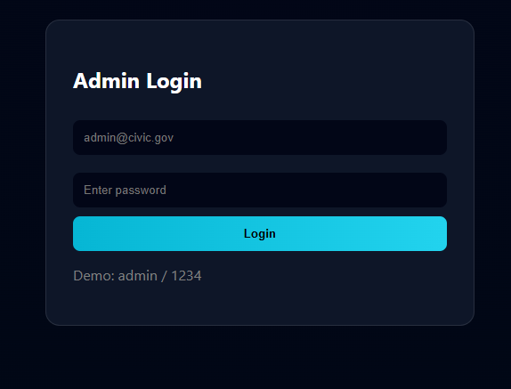
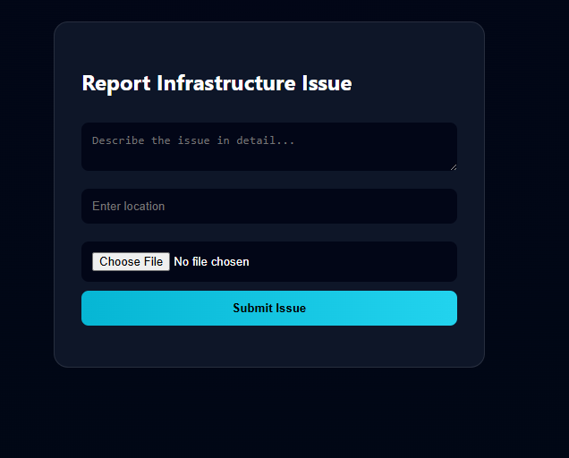
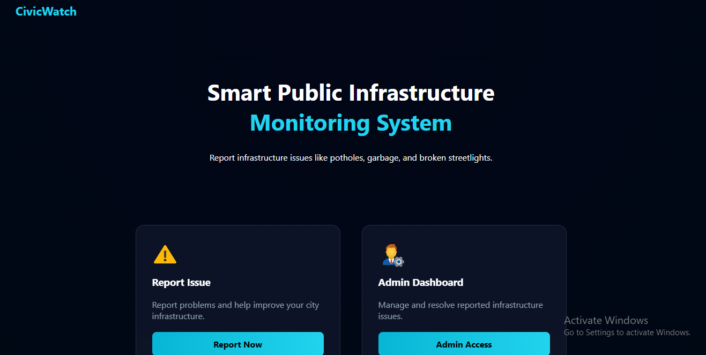

# 🚀 Smart Public Infrastructure Monitoring System (CivicWatch)

A modern web-based application that allows citizens to report infrastructure issues like potholes, garbage, broken streetlights, and water leaks.

---

## 🌐 Features

* 📝 Report issues with description and location
* 📸 Upload images of the issue
* 🔐 Admin login system
* 📊 Admin dashboard to manage complaints
* ✅ Status tracking (Pending / Resolved)
* 🎨 Modern dark-themed UI

---

## 🛠️ Tech Stack

* Backend: Python (Flask)
* Database: SQLite
* Frontend: HTML, CSS
* Storage: Local file system

---

## 📂 Project Structure

smart-public-infrastructure-monitoring/
│── app.py
│── static/
│   ├── style.css
│   ├── uploads/
│── templates/
│   ├── index.html
│   ├── report.html
│   ├── admin_login.html
│   ├── admin_dashboard.html

---

## ▶️ How to Run

pip install flask
python app.py

Open browser:
http://127.0.0.1:5000/

---

## 🔐 Admin Credentials

* Username: admin
* Password: 1234

---

## 📸 Screenshots

### 🏠 Landing Page

### 📝 Report Page

### 📊 Admin Dashboard

## 🎯 Future Improvements

* 📍 Map integration
* 📧 Notifications
* 🤖 AI-based issue detection
* 📊 Analytics dashboard

